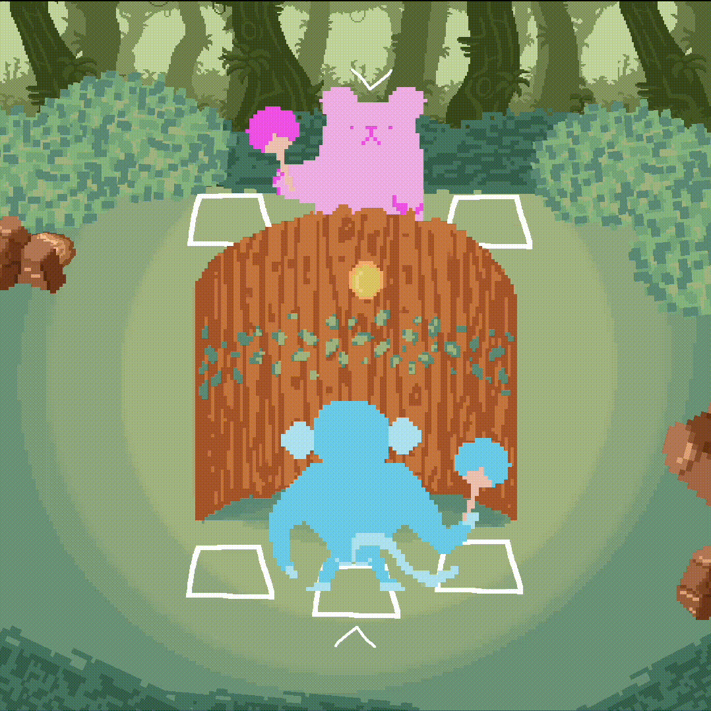

<h1 align="center">Ping Pong Selvagem 🐒🏓🐻</h1>

Um protótipo de um jogo de Ping Pongo feito para um desafio da PUC-PR.

A ping pong prototype game made for a Pontifical University of Parana Challenge.

  <a href="./CONTRIBUTION.md">Contributing/Contribuição</a> |
  <a href="https://eloquent-brahmagupta-f513c4.netlify.app/">Play</a> |
  <a href="./LICENSE">Licença/License</a>

## 🌎 Sobre | About

Este jogo é feito usando a Construct 3 engine, mas também possui algumas modificações de JavaScript para otimizar e controlar coisas como seria renderizada no navegador.

This game is made using Construct 3 engine, but it has some JavaScript modifications to it to optimize and control things like how it would be rendered on the browser.

### More details | Mais detalhes (Currently only in portuguese)

## 📄 Licença | License

Permissions of this strong copyleft license are conditioned on making available complete source code of licensed works and modifications, which include larger works using a licensed work, under the same license. Copyright and license notices must be preserved. Contributors provide an express grant of patent rights.

| Permissions | Restrictions | Conditions
| --- | --- | --- 
&check; Commercial Use | &times; Liability | &#x1f6c8; License and Copyright Notice
&check; Modification   | &times; Warranty | &#x1f6c8; State changes
&check; Distribution |  | &#x1f6c8; Disclose source
&check; Patent Use |  | &#x1f6c8; Same license
&check; Private Use